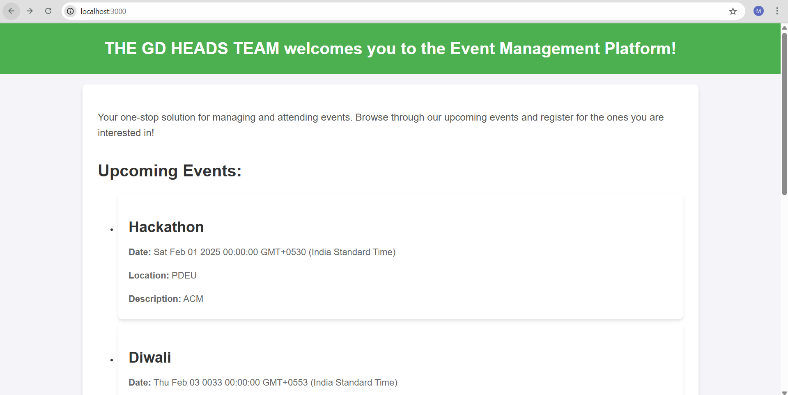
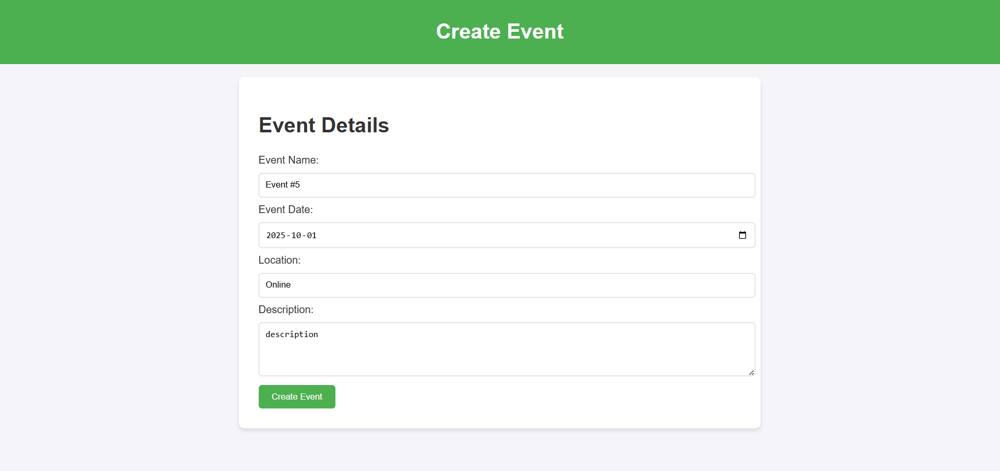
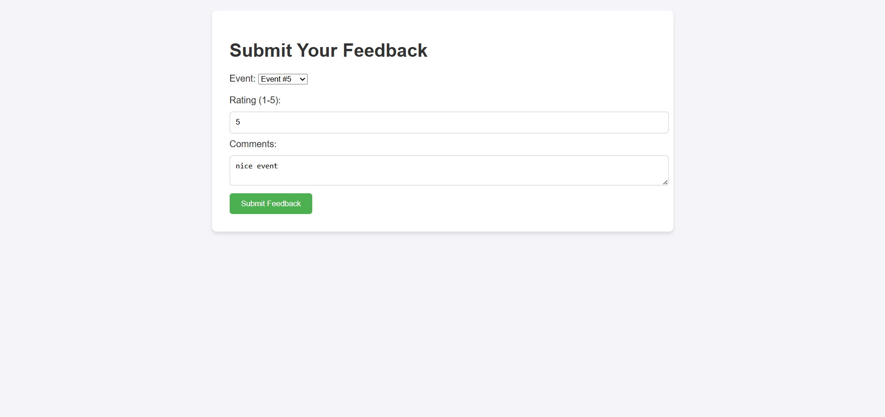
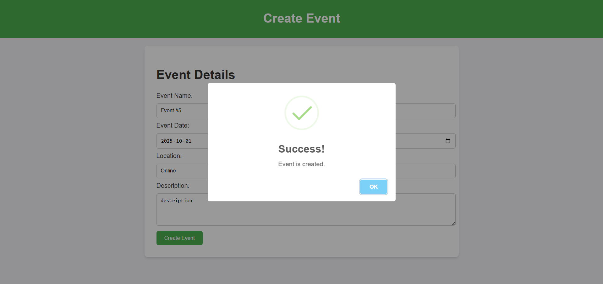
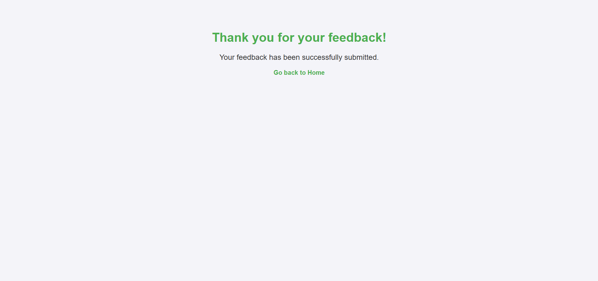

# event-management-platform

# Event Management Platform

A simple web application built with **Express.js** and **PostgreSQL** for managing events and collecting feedback from attendees.

## Features

- ✅ Create new events with details like name, date, location, and description
- ✅ Submit feedback for a specific event with rating and comments
- ✅ Confirmation messages on successful creation and submission

## Tech Stack

- **Backend**: Node.js with Express.js
- **Database**: PostgreSQL
- **Frontend**: HTML + CSS 

## Screens Overview

- **Create Event Page**: Form to add new event details


- **Submit Feedback Page**: Dropdown to select event, input for rating and comments


- **Success Screens**: Confirmation for both event creation and feedback submission





## Getting Started

### Prerequisites

- Node.js (v18+ recommended)
- PostgreSQL (v13+)

### Installation

```bash
git clone https://github.com/maitreemistry/event-management-platform.git
cd event-management-platform
npm install
